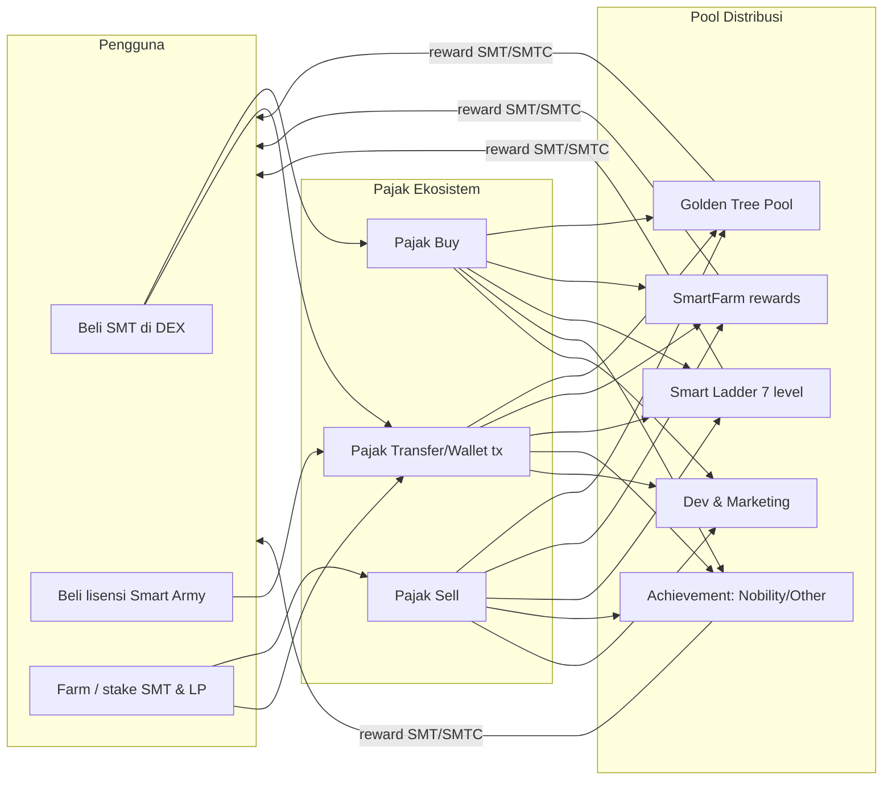

# 01 — BRD (Business Requirements Document)

> **Smart Ecosystem (SMT)** · Versi 1.0 · Status: Aktif
> Audiens: Owner, Project Manager, Investor, Stakeholder bisnis

---

## 1. Ringkasan Eksekutif

Smart Ecosystem adalah platform **DeFi (Decentralized Finance)** yang berjalan di **BNB Smart Chain** dengan token utama **SMT (Smart Token)** dan token reward **SMTC (Smart Token Cash)**. Platform menggabungkan:

1. **Tokenomics berbasis pajak (tax)** — setiap transaksi beli/jual/transfer SMT dikenakan pajak yang didistribusikan otomatis ke pool ekosistem (Golden Tree Pool, farming, ladder referral, achievement, development).
2. **Lisensi keanggotaan (Smart Army License)** — pengguna membeli lisensi (Trial → Visionary) menggunakan SMT untuk membuka akses fitur, level referral, dan porsi reward.
3. **Farming & staking** — pengguna mem-farm SMT / LP token untuk reward harian.
4. **Referral ladder (Smart Ladder)** — sistem jejaring 7 level yang mendistribusikan bagian pajak ke sponsor.
5. **Gamifikasi (Golden Tree, Nobility, Chest, Quest, Surprise rewards)** — mekanisme growth & achievement yang mengunci reward berkelanjutan bagi kontributor aktif.
6. **DEX integration** — swap SMT/BNB/BUSD dan pengelolaan LP melalui PancakeSwap (langsung dari dApp).

**Nilai jual utama:** ekosistem tertutup yang menghargai loyalitas — semakin lama & aktif seorang anggota (lisensi + farming + growth), semakin besar porsi reward otomatis yang ia terima, tanpa perlu klaim manual ke pihak ketiga karena semua terdistribusi on-chain.

---

## 2. Latar Belakang & Masalah

| Masalah di pasar DeFi umum | Solusi Smart Ecosystem |
|---|---|
| Reward terdistribusi manual / tidak transparan | Semua distribusi pajak & reward dieksekusi **smart contract**, dapat diaudit on-chain |
| Referral (MLM-style) sering penipuan / ponzi | Ladder dibatasi **7 level**, reward bersumber dari **pajak transaksi riil**, bukan uang anggota baru |
| Token reward tanpa utilitas | SMTC dipakai lintas modul (chest, quest, surprise) dan dapat di-*sell* kembali ke pool |
| Pengguna awam kesulitan pakai DeFi | dApp satu pintu: beli token, beli lisensi, farm, klaim reward, kelola tim — semua dalam satu aplikasi web |
| Kontrak tidak bisa diperbaiki (immutable) | Semua kontrak bisnis memakai **UUPS upgradeable** dengan kontrol `owner` |

---

## 3. Visi, Misi, dan Tujuan Bisnis

### Visi
Menjadi ekosistem keuangan digital komunitas yang adil, transparan, dan berkelanjutan di BNB Smart Chain.

### Misi
- Memberi akses reward pasif yang **terprogram dan terdistribusi otomatis** kepada anggota aktif.
- Menyediakan aplikasi tunggal yang mudah digunakan pemula sekalipun.
- Menjaga keberlanjutan pool melalui mekanisme fase (Golden Tree Phase) dan batas supply.

### Tujuan Bisnis (SMART)
| ID | Tujuan | Indikator | Target awal |
|----|--------|-----------|-------------|
| B1 | Pertumbuhan anggota berlisensi | Jumlah `licensedUsers` di SmartArmy | 10.000 akun aktif |
| B2 | Likuiditas sehat | TVL pool SMT-BNB & SMT-BUSD | Tumbuh ≥ 10% per kuartal |
| B3 | Adopsi farming | Total SMT ter-stake di SmartFarm | ≥ 20% circulating supply |
| B4 | Aktivitas referral | Distribusi `Activity.totalDistributed` di SmartLadder | Naik per bulan |
| B5 | Keberlanjutan pool | Golden Tree phase progression tanpa pool habis | Fase naik berkala |
| B6 | Keandalan produk | Uptime dApp, incident kontrak | 99.5% uptime, 0 exploit |

---

## 4. Stakeholder & Peran

| Stakeholder | Peran | Kepentingan utama |
|---|---|---|
| **Owner / Project Owner** | Kepemilikan kontrak (`owner`), keputusan strategis, treasury | Keberlanjutan, keamanan aset |
| **Operator** | Akun `onlyOperator` di SmartToken: set pajak, whitelist | Kendala operasional harian |
| **Distributor** | `addDistributor` di GoldenTreePool & achievement: memicu `notifyReward` | Distribusi reward |
| **Project Manager** | Eksekusi roadmap, koordinasi tim | Klaritas scope, dokumentasi |
| **Developer (Frontend)** | Aplikasi React dApp | DX, standar kode |
| **Developer (Web3/Solidity)** | Kontrak, deploy, upgrade | Keamanan, gas |
| **QA** | Uji fungsional & acceptance criteria | Definisi selesai yang jelas |
| **Anggota / End User** | Pemegang SMT, pembeli lisensi, farmer | Reward, kemudahan, keamanan dana |
| **Auditor / Komunitas** | Review kontrak & transparansi | Kebenaran on-chain |

---

## 5. Model Bisnis & Sumber Nilai

### 5.1 Arus nilai (value flow)

### 5.2 Struktur pajak (dari kontrak `SmartToken`)

- Pajak dipisah per jenis transaksi: **buy**, **sell**, **transfer/wallet** (masing-masing punya komposisi sendiri: `referralFee`, `goldenPoolFee`, `devFee`, `achievementFee`, `farmingFee`, `burnFee`).
- Terdapat **emergency tax** yang bisa diaktifkan operator saat kondisi pasar ekstrem (harga turun ≥ 25% dalam 24 jam → pajak +10%, durasi 24 jam) — sesuai teks tooltip dashboard.
- Nilai persentase aktif **selalu dibaca on-chain** — dashboard "Current Tax" menampilkan angka live, bukan hardcode.
- Distribusi ladder per aktivitas memakai `share[7]` (7 slot level). Default `buytax`: `[50%, 5%, 5%, 7.5%, 7.5%, 12.5%, 12.5%]`; `farmtax`: `[55%, 2.5%, 2.5%, 7.5%, 7.5%, 12.5%, 12.5%]` (basis 10000 → lihat `initActivities`).

### 5.3 Pendapatan & biaya proyek
| Sumber | Mekanisme |
|---|---|
| Portion dev/marketing dari pajak | Otomatis ke wallet dev sesuai konfigurasi kontrak |
| Fee bridge/swap | `SMTBridge.setAggregatorFee` — fee atas swap tertentu |
| Lisensi | Harga lisensi dibayar dalam SMT; sebagian masuk pool ekosistem |

Biaya utama: gaji tim, audit keamanan, infrastruktur (hosting dApp, RPC), gas operasional owner/operator/distributor.

---

## 6. Ruang Lingkup Bisnis

### Dalam scope (fase saat ini)
- dApp web (desktop & mobile responsive) tanpa aplikasi native.
- BNB Smart Chain mainnet & testnet.
- Seluruh modul: lisensi, farming, ladder, golden tree, nobility/other achievement, swap & LP, pesan/pengumuman, legal.

### Di luar scope (saat ini)
- Aplikasi mobile native (iOS/Android).
- Chain lain (Polygon/Ethereum/Fantom hanya tersedia sebagai RPC di config kontrak, belum dipakai dApp).
- fiat on-ramp.

---

## 7. Risiko & Mitigasi

| # | Risiko | Dampak | Probabilitas | Mitigasi |
|---|--------|--------|--------------|----------|
| R1 | Celah/exploit kontrak pintar | Dana hilang, reputasi hancur | Rendah–Sedang | Audit sebelum upgrade besar, UUPS dengan `onlyOwner` upgrade, test suite (`ecosystem.test.js`), timelimit operator |
| R2 | Kompromi kunci owner/deployer | Kontrak bisa di-upgrade pihak jahat | Rendah | Cold wallet, **rotasi ownership** (lihat catatan `.env.example` — kunci lama pernah terekspos di repo, wajib rotasi), multisig (rekomendasi) |
| R3 | Pool reward terkuras /经济 unsustainable | Reward berhenti, anggota pergi | Sedang | Mekanisme phase & threshold Golden Tree, `setLimitPerSwap`, emergency tax |
| R4 | RPC BSC down / rate limit | dApp tidak bisa baca data | Tinggi | Multi-RPC fallback (`REACT_APP_NODE_1..3`), RPC berbayar opsional |
| R5 | Perubahan regulasi kripto | Operasi dibatasi | Sedang | Struktur legal, halaman Legal Agreement, kompli komunitas |
| R6 | Ketergantungan PancakeSwap (router/factory) | Integrasi swap rusak bila router berubah | Rendah | `setUniswapRouter` / `setPancakeFactory` bisa diperbarui owner |
| R7 | WalletConnect quota / perubahan API | Satu metode connect mati | Sedang | Multi-wallet: Injected (MetaMask/Trust), Binance Chain wallet, WalletConnect v2 dengan `REACT_APP_WALLETCONNECT_PROJECT_ID` |

---

## 8. KPI & Cara Mengukur (semua on-chain)

| KPI | Sumber data | Cara baca |
|---|---|---|
| Jumlah pemegang lisensi aktif | `SmartArmy.licensedUsers()` + `isActiveLicense(addr)` | Skrip off-chain / dashboard admin |
| Level lisensi terjual per tier | `SmartArmy.licenseTypeOf(level)` + event `RegisterLicense` | Event log di BscScan |
| TVL farming | `SmartFarm.balanceOf(total)` | Call kontrak |
| Pertumbuhan Golden Tree | `GoldenTreePool.currentTotalGrowth()`, `currentPhaseOfGoldenTree()` | Call kontrak |
| Distribusi referral | `SmartLadder.activities(id).totalDistributed` | Call kontrak |
| Volume & holder | Explorers (BscScan) / The Graph opsional | API explorer |

---

## 9. Keberhasilan Jangka Pendek (90 hari)

1. 100% modul utama lolos acceptance criteria FRD (03) di testnet.
2. Audit internal semua fungsi admin (operator/distributor) + mitigasi R2.
3. Dokumen ini selalu sinkron dengan kode (checklist di Contributing).
4. Onboarding baru (developer) bisa berjalan lokal < 30 menit memakai Technical Guide.

---

*Lampiran: rincian per modul ada di FRD (03); spesifikasi kontrak di (06).*
