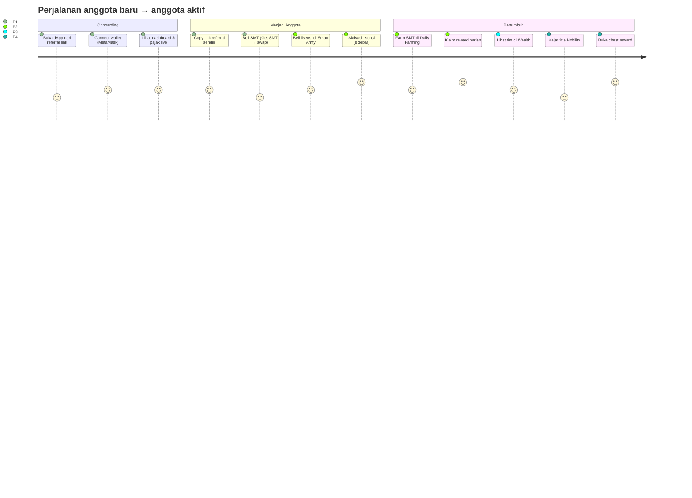

# 02 — PRD (Product Requirements Document)

> **Smart Ecosystem dApp** · Versi 1.0 · Status: Aktif
> Audiens: PM, PO, Designer, Developer, QA
> Pendahulu: BRD (01) menjelaskan "mengapa"; dokumen ini menjelaskan **"produk apa yang dibangun"**. Spesifikasi teknis rinci per modul ada di FRD (03).

---

## 1. Produk

**Smart Ecosystem dApp** — aplikasi web (SPA) satu pintu yang menghubungkan pengguna ke seluruh kontrak ekosistem SMT di BNB Smart Chain: membeli lisensi, farming, melacak tim referral, mengklaim reward (farming/nobility/chest/quest/surprise), melakukan swap & mengelola likuiditas, membaca pengumuman, dan dokumen legal.

**Platform:** Web responsive (desktop-first, mobile wajib layar pakai drawer sidebar kiri/kanan).
**Tanpa akun password:** identitas = wallet address. Data profil (nama, telegram, avatar) disimpan on-chain via `tokenUri` (IPFS).

---

## 2. Personas & User Stories

### P1 — "Budi", Crypto Newbie (25–40)
Baru punya MetaMask, dengar SMT dari teman. Ingin ikut tapi takut rumit.
> *"Saya mau beli SMT, gabung lewat link referral teman, dan langsung paham reward saya."*

**Kebutuhan:** onboarding connect wallet yang jelas, copy referral link otomatis, tampilan ringkas (Dashboard), bahasa UI sederhana.

### P2 — "Sari", Farmer Aktif (25–45)
Sudah pegang SMT, mau optimalkan reward harian.
> *"Saya mau tahu reward farming saya berapa, klaim cepat, dan pantau pajak/portal likuiditas."*

**Kebutuhan:** halaman Daily Farming dengan riwayat earning, multi-tab reward, indikator pajak live, chart portofolio.

### P3 — "Anton", Team Leader / Networker (30–55)
Punya komunitas, mengandalkan referral.
> *"Saya mau lihat anggota tim saya per level, siapa aktif, dan komisi ladder saya."*

**Kebutuhan:** Wealth → Team Management (General & Direct Sales) dengan drill-down per address/level, statistik tim, alat tools.

### P4 — "Rina", Whale / Visionary (30–50)
Target lisensi tertinggi & title nobility.
> *"Saya mau upgrade lisensi, kejar title King, buka chest, dan pantau progres Golden Tree."*

**Kebutuhan:** Smart Army upgrade flow, Nobility progression, chest open dengan reward acak, statistik Golden Tree phase.

### P5 — "Owner/Operator" (internal)
Mengelola parameter ekosistem.
> *"Saya butuh akses cepat ke fungsi admin kontrak & memantau kesehatan ekosistem."*

**Kebutuhan:** (saat ini via BscScan/owner wallet; rekomendasi future: admin console terbatas).

---

## 3. Fitur Produk & Prioritas (MoSCoW)

| Modul | Ringkasan | Prioritas | Detail |
|-------|-----------|-----------|--------|
| Connect Wallet | MetaMask/Trust (Injected), Binance Wallet, WalletConnect v2 | **Must** | FRD M1 |
| Dashboard | Portofolio, notifikasi, pajak live, SMT monitor, referral link, golden tree ringkas | **Must** | FRD M2 |
| Smart Army License | Beli (register), aktivasi, upgrade, perpanjang, liquidate lisensi | **Must** | FRD M3 |
| Rewards — Daily Farming | Stake/withdraw SMT, reward fixed + LP + sell-tax distribution, riwayat | **Must** | FRD M4 |
| Rewards — Nobility (Golden/Passive/Chest) | Progres title, klaim noble/passive/chest reward | **Must** | FRD M5 |
| Rewards — Quest & Surprise | Klaim quest reward; beli SMT → kesempatan surprise reward | **Should** | FRD M6 |
| Achievement | Badge/title yang terkumpul, progres nobility | **Should** | FRD M7 |
| Golden Tree | Statistik growth, kontribusi personal, phase progression | **Should** | FRD M8 |
| Get SMT / SMTC | Swap SMT↔BNB/BUSD via bridge, add/remove liquidity SMT-BNB | **Must** | FRD M9 |
| Wealth — Dashboard & Team Management | Statistik kekayaan, tim 7 level (general), direct sales, tools | **Must** | FRD M10 |
| Messages & Legal | Kotak pesan/pengumuman, dokumen legal agreement | **Should** | FRD M11 |
| Status pages | 404/500/Coming Soon/Maintenance | **Could** | FRD M12 |
| (Future) Admin console | UI internal untuk fungsi operator/distributor | **Won't** (fase ini) | — |

---

## 4. User Journey Utama

---

## 5. Persyaratan Produk (Non-Fungsional)

| Kategori | Persyaratan |
|----------|-------------|
| **Performa** | First load ≤ 5 dtk di 4G; perubahan halaman instan (code-splitting per route via `React.lazy`); baca data on-chain paralel (multicall) |
| **Ketersediaan** | Frontend statis (CDN) target 99.5%+; RPC fallback 3 endpoint |
| **Keamanan** | Kunci pribadi TIDAK PERNAH menyentuh aplikasi (signing via wallet provider); tidak ada REST server menyimpan data sensitif; env var hanya non-rahasia (RPC, WalletConnect Project ID) |
| **Kompatibilitas** | Chrome/Edge/Firefox/Brave terbaru; mobile browser dengan wallet injected (MetaMask app browser, Trust browser) |
| **Jaringan** | ChainId 56 (mainnet) & 97 (testnet); aplikasi menolak/memberi warning di chain lain |
| **Aksesibilitas** | Kontras teks memenuhi standar; semua aksi punya feedback visual (toast, loading state) |
| **i18n** | Saat ini EN; struktur teks terpusat agar mudah dilokalkan (future ID) |
| **Observability** | Sentry (`@sentry/react`) untuk error runtime; NProgress untuk indikator loading route |
| **UX** | Animasi masuk halaman & hover micro-interactions (lihat `src/theme/animations.css`), respons < 100ms untuk feedback visual |

---

## 6. Metrik Produk (North Star & pendukung)

| Metrik | Definisi | Sasaran |
|--------|----------|---------|
| **North Star: Reward yang terdistribusi per minggu** | Total SMT/SMTC event `RewardAdded`/`ReferralReward`/`Claimed` | Naik konsisten |
| Wallet unique terhubung | Event connect (analitik frontend) | +15%/bulan |
| Konversi lisensi | % wallet terhubung yang punya lisensi aktif | ≥ 30% |
| Retensi klaim | Wallet yang klaim reward ≥ 2×/minggu | ≥ 40% |
| Volume swap via dApp | Event bridge/swap | Naik bulanan |
| Error rate frontend | Sentry issues per sesi | < 1% |

---

## 7. Roadmap Indikatif

| Fase | Isi | Status |
|------|-----|--------|
| **F0 — Fondasi** (selesai) | 10 kontrak terdeploy BSC mainnet, dApp lengkap, CI build | ✅ |
| **F1 — Pemantahan & QA** | Test suite E2E, sinkronisasi FRD, audit internal fungsi admin | 🚧 |
| **F2 — Pengalaman** | Light mode (sudah ada tombol placeholder), i18n ID/EN, notifikasi on-chain indexer | 📋 |
| **F3 — Pertumbuhan** | Admin console operator, referral landing page, analitik produk | 📋 |
| **F4 — Ekspansi** | Chain tambahan (bridge), mobile PWA installable | 💡 |

> Roadmap adalah *living document* — PM memperbarui tiap sprint planning.

---

## 8. Kriteria Penerimaan Produk (level produk)

1. Seluruh alur **Must** di FRD berjalan di testnet & mainnet tanpa bloker.
2. Semua angka finansial (saldo, pajak, reward) **selalu dibaca dari kontrak**, bukan konstanta mock — kecuali data demo yang ditandai eksplisit.
3. Pengguna dengan wallet tanpa jaringan salah tetap mendapat pesan yang jelas, bukan layar putih.
4. Transaksi gagal (revert) selalu menampilkan alasan yang dapat dipahami pengguna.
5. Aplikasi tetap dapat dibuka (read-only) tanpa wallet terhubung.
