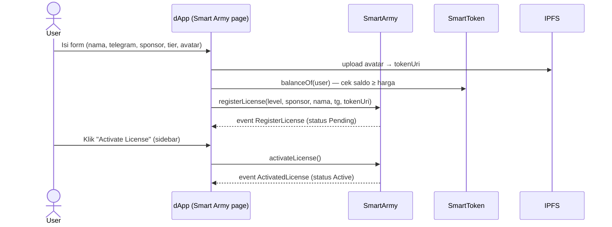
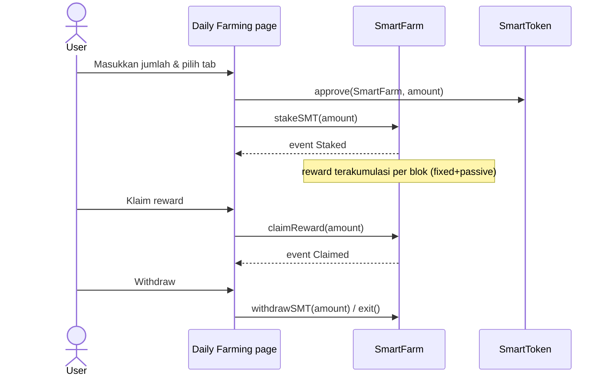

# 03 — FRD (Functional Requirements Document)

> **Smart Ecosystem dApp** · Versi 1.0
> Audiens: Developer, QA. Setiap modul berisi: deskripsi, aktor, alur, kebutuhan fungsional (FR-xx), acceptance criteria (AC-xx), pemetaan teknis (komponen & kontrak).
> Konvensi prioritas: **M** = Must, **S** = Should, **C** = Could.

---

## 0. Template FRD Modul (untuk fitur baru)

```markdown
## Mxx — <Nama Modul>
- Prioritas: M/S/C
- Deskripsi: <1–3 kalimat>
- Aktor: <Visitor / Member / Owner>
- Alur: <langkah pengguna + sequence diagram bila perlu>
- FR-xx-a: <kebutuhan fungsional atomik>
- AC-xx-1: <Given/When/Then>
- Pemetaan: <komponen UI, hook, kontrak.fungsi>
```

---

## M1 — Autentikasi & Connect Wallet  `M`

### Deskripsi
Pengguna menghubungkan wallet untuk membaca data & mengirim transaksi. Tidak ada username/password; identitas = address.

### Aktor
Visitor (belum connect), Member (terhubung).

### Kebutuhan Fungsional
| ID | Kebutuhan |
|----|-----------|
| FR-1-a | Aplikasi menawarkan 3 metode: **Injected** (MetaMask/Trust), **Binance Chain Wallet**, **WalletConnect v2** (hanya bila `REACT_APP_WALLETCONNECT_PROJECT_ID` tersedia) |
| FR-1-b | Aplikasi mencoba reconnect otomatis saat reload (`useEagerConnect`) |
| FR-1-c | Bila chain tidak didukung (bukan 56/97), tampil peringatan & transaksi diblokir |
| FR-1-d | Perubahan akun/chain di wallet tercermin di UI tanpa refresh |
| FR-1-e | Tombol profil menampilkan address terpotong (`0x1234…abcd`) + menu profil |
| FR-1-f | Modal wallet menampilkan daftar opsi + status koneksi |

### Acceptance Criteria
- **AC-1-1** *Given* wallet MetaMask terpasang, *when* user klik Connect → Injected → *then* address tampil di header & sidebar profil terisi.
- **AC-1-2** *Given* user di chain 1 (Ethereum), *when* app load, *then* banner peringatan chain muncul dan tombol transaksi disabled.
- **AC-1-3** *Given* WalletConnect tanpa Project ID, *when* modal dibuka, *then* opsi WalletConnect tidak tampil (bukan error).

### Pemetaan
- Komponen: `layouts/SidebarLayout/wallet-modal`, `Header/Buttons/ConnectWallet`, `Header/Userbox`
- Kode: `src/utils/connectors.ts`, `src/contexts/auth`, `hooks/useEagerConnect.ts`, `hooks/useInactiveListener.ts`
- Library: `@web3-react/core` v6, `web3modal`, `@walletconnect/ethereum-provider` v2

---

## M2 — Dashboard (Main)  `M`

### Deskripsi
Pusat informasi anggota: hero slider, notifikasi agregat, portofolio (chart), achievement ringkas, monitor SMT/SMTC, referral link, pajak live, ringkasan Golden Tree, learn-more.

### Kebutuhan Fungsional
| ID | Kebutuhan |
|----|-----------|
| FR-2-a | Hero slider autoplay (desktop & mobile asset terpisah) |
| FR-2-b | Notifikasi berkategori (personal/global/announcement) dengan tab & counter; konten dari `SampleData` (mock) — **future**: indexer |
| FR-2-c | Chart portofolio dengan periode 1d/1w/1mo/1y dan tab kategori (Summary, LP Token, Teamwork, Farming Rewards, Nobility Rewards, Other Rewards) |
| FR-2-d | Pajak live (Buy/Sell/Wallet/Farming) dibaca dari kontrak via `useSMTInfo` + `useSmartFarmInfo`; status emergency tax menyesuaikan |
| FR-2-e | Monitor SMT & SMTC: harga display, supply, pool, dsb (parsial mock — tandai eksplisit) |
| FR-2-f | Referral link `origin/p-id=<address>` + tombol copy (toast "copied") |
| FR-2-g | Kartu Golden Tree ringkas: phase aktif, progress bar growth (animasi shimmer), tombol detail |
| FR-2-h | Kartu "New to Smart Ecosystem?" dengan CTA ke whitepaper |
| FR-2-i | Seluruh konten punya entrance animation & hover micro-interaction (stagger cascade) |

### Acceptance Criteria
- **AC-2-1** *Given* wallet terhubung, *when* dashboard load, *then* referral link berisi address user dan tombol copy menyalin ke clipboard.
- **AC-2-2** *Given* `emergency_tax = true` on-chain, *when* kartu pajak render, *then* label "Emergency tax is active" tampil.
- **AC-2-3** *Given* tanpa wallet, *when* dashboard load, *then* halaman tetap terbuka (read-only) tanpa crash.

### Pemetaan
- Halaman: `src/content/main/dashboard/`
- Hooks: `useSMTInfo`, `useSmartFarmInfo`, `useTokenPrices`, `useTokenBalances`
- Kontrak: `SmartToken` (tax info), `GoldenTreePool` (growth/phase)

---

## M3 — Smart Army License  `M`

### Deskripsi
Sistem keanggotaan berbasis NFT-lisensi. Empat tier lisensi dibeli dengan SMT; lisensi harus **diaktifkan** setelah registrasi, punya masa aktif (~6 bulan), bisa di-upgrade, diperpanjang, atau dicairkan (liquidate).

### Data (dari kontrak `SmartArmy._initLicenseTypes`)
| Level | Nama | Harga (SMT) | Ladder Level | Masa aktif |
|-------|------|-------------|--------------|------------|
| 1 | Trial | 100 | 1 | ~6 bulan |
| 2 | Opportunist | 1.000 | 3 | ~6 bulan |
| 3 | Runner | 5.000 | 5 | ~6 bulan |
| 4 | Visionary | 10.000 | 7 | ~6 bulan |

Status lisensi (`LicenseStatus`): `None → Pending → Active → Liquidated`.

### Alur Utama


### Kebutuhan Fungsional
| ID | Kebutuhan |
|----|-----------|
| FR-3-a | Form registrasi memvalidasi: nama non-kosong, sponsor address valid, saldo SMT ≥ harga tier |
| FR-3-b | Harga tier dibaca live dari `licenseTypes(level)` |
| FR-3-c | Sidebar menampilkan state: belum punya ("Please exchange license") / Pending ("Activate License") / Active (nama tier + countdown) |
| FR-3-d | Upgrade tier: selisih harga dibayar dengan SMT; hanya dari tier lebih rendah |
| FR-3-e | Extend: perpanjang masa aktif (fee BNB per `feeInfo.extendFeeBNB`) |
| FR-3-f | Liquidate: hentikan lisensi & tarik LP terkunci (kena `penaltyFeePercent`) |
| FR-3-g | Semua transaksi menampilkan pending → sukses/gagal (toast) dengan hash |
| FR-3-h | Privilege card menampilkan benefit per level (ladder lv, farming rewards %, akses modul) |

### Acceptance Criteria
- **AC-3-1** *Given* saldo SMT 50, *when* user pilih Trial (100 SMT) & submit, *then* muncul pesan saldo tidak cukup, tanpa mengirim tx.
- **AC-3-2** *Given* lisensi Pending, *when* activate sukses, *then* sidebar berubah ke tier + countdown, status on-chain Active.
- **AC-3-3** *Given* lisensi Active level 1, *when* upgrade ke level 2, *then* tx sukses & event `UpgradeTreePhase`/`TransferLicense` tercatat; UI refresh otomatis.

### Pemetaan
- Halaman: `src/content/main/smart-army/` (+ popover-group untuk konfirmasi upgrade/extend/liquidate)
- Hook: `useSmartArmy` (`exchangeLicense`, `initActivate`, `fetchLicense`, `fetchLicenseType`, `fetchUserInfo`)
- Kontrak: `SmartArmy`, `SmartToken`, `ipfs.ts` (config IPFS)

---

## M4 — Rewards: Daily Farming  `M`

### Deskripsi
Pengguna mem-farm SMT di SmartFarm dan menerima tiga jenis reward: **Fixed Rewards** (0.1%/hari dari jumlah farm), **LP Rewards** (0.17% dari LP token), dan **Sell Tax Distribution** (bagian pajak jual ke farmer).

### Alur


### Kebutuhan Fungsional
| ID | Kebutuhan |
|----|-----------|
| FR-4-a | Tiga tab reward dengan penjelasan tooltip masing-masing |
| FR-4-b | Tabel earning history (desktop & mobile) menampilkan riwayat stake/claim |
| FR-4-c | Progress bar likuiditas portal dengan animasi (`BorderLinearProgress`) |
| FR-4-d | Approve → stake dua langkah; tombol disabled saat pending |
| FR-4-e | Menampilkan: total staked user, reward belum diklaim (`earned`, `earnedPassive`), reserve |
| FR-4-f | CTA "Check on bscscan" membuka explorer |

### Acceptance Criteria
- **AC-4-1** *Given* belum approve, *when* stake, *then* tx approve dijalankan dulu, lalu stake otomatis.
- **AC-4-2** *Given* reward > 0, *when* klaim sebagian, *then* saldo bertambah sesuai jumlah & riwayat ter-update.
- **AC-4-3** *Given* stake 0, *when* buka halaman, *then* tombol withdraw disabled.

### Pemetaan
- Halaman: `src/content/main/reward/daily-farming/` (FixedBar/LPBar/SellBar/EarningHistoryTable)
- Hook: `useFarmingStakeSMT`, `useFarmHarvest`, `useSmartFarmInfo`
- Kontrak: `SmartFarm` (`stakeSMT`, `withdrawSMT`, `claimReward`, `earned`, `earnedPassive`, `balanceOf`)

---

## M5 — Rewards: Nobility (Golden / Passive / Chest)  `M`

### Deskripsi
Sistem achievement berjenjang 8 title: **Folks → Baron → Count → Viscount → Earl → Duke → Prince → King**. Syarat berbasis porsi/growth (parameter per title di kontrak, termasuk biaya upgrade & chest supply).

### Kebutuhan Fungsional
| ID | Kebutuhan |
|----|-----------|
| FR-5-a | Halaman Golden Phase: dua tab — "For Noble Leaders" & "For Farmers" dengan distribusi reward |
| FR-5-b | Passive Phase: klaim `claimPassiveShareReward` menampilkan harvested vs not-harvested (`fetchPassiveRewardsAmount`) |
| FR-5-c | Chest: 7 slot chest (0.5/5/50/0.5/5/50/500) dengan reward acak on-chain (`getChestRandomReward`); klaim via `claimChestSMTReward` / `claimChestSMTCReward`; double-claim bar menampilkan sisa SMT & SMTC |
| FR-5-d | Porsi reward per title (frontend `PortionInfo`): Folks 1, Baron 1.5, Count 2, Viscount 2.5, Earl 3, Duke 3.5, Prince 4, King 5 |
| FR-5-e | Progres nobility menampilkan syarat berikutnya (`isUpgradeable(from,to)` → bool + harga) |
| FR-5-f | Reward hanya bisa diklaim bila `isPossibleNobilityReward` true; tombol disabled dengan alasan |
| FR-5-g | Popover klaim bertingkat: Claim → Receive → Confirm (Sure) → success |

### Acceptance Criteria
- **AC-5-1** *Given* title Baron, *when* buka chest, *then* reward dihitung on-chain sesuai supply tier Baron, SMT/SMTC masuk wallet.
- **AC-5-2** *Given* belum punya nobility title, *when* buka Rewards, *then* kartu Nobility & Golden Tree berstatus "Unavailable" (disabled).
- **AC-5-3** *Given* passive reward belum diklaim = X, *when* klaim penuh, *then* harvested naik X dan not-harvested 0.

### Pemetaan
- Halaman: `src/content/main/reward/nobility/{golden,passive,chest}/`
- Hook: `useRewards`, `useSmartAchievement`
- Kontrak: `SmartNobilityAchievement`, `GoldenTreePool`

---

## M6 — Rewards: Quest & Surprise  `S`

| ID | Kebutuhan |
|----|-----------|
| FR-6-a | Quest: menampilkan claimed vs unclaimed (`fetchQuestRewards`); klaim via kontrak OtherAchievement (sumber wallet `NA_Quest`) |
| FR-6-b | Surprise: kartu promo "Buy SMT as many as possible, win the big rewards!", statistik, double-claim bar; klaim `claimSurprizeSMTReward`/`claimSurprizeSMTCReward` |
| FR-6-c | Kedua modul disabled (abu) bila syarat belum terpenuhi |

**AC-6-1** *Given* unclaimed quest = 0, *when* halaman load, *then* tombol klaim disabled.
**AC-6-2** *Given* surprise reward tersedia, *when* klaim, *then* event `RewardSwapped` tercatat & saldo bertambah.

Pemetaan: `src/content/main/reward/{quest,surprise}/`, hook `useRewards`, kontrak `SmartOtherAchievement`.

---

## M7 — Achievement (Overview)  `S`

| ID | Kebutuhan |
|----|-----------|
| FR-7-a | Menampilkan "Last achieved" (list title), "Collected Badges", "Collected Titles" |
| FR-7-b | Quest Distribution: tabel & progress per kategori (`quest-distribution`) |
| FR-7-c | Link "See more" ke dokumentasi eksternal |

Pemetaan: `src/content/main/achievement/`, hook `useSmartAchievement`.

---

## M8 — Golden Tree  `S`

| ID | Kebutuhan |
|----|-----------|
| FR-8-a | Menampilkan total growth ekosistem (`currentTotalGrowth`), phase aktif (`currentPhaseOfGoldenTree`), growth & contribution pribadi (`growthBalanceOf`, `contributionOf`) |
| FR-8-b | Growth tab (digit 0–9) menampilkan detail fase terkait |
| FR-8-c | Progress bar "x/y Growth" dengan persentase kontribusi user |
| FR-8-d | Reward Qualification & Tree Phase cards menjelaskan syarat fase berikut |

**AC-8-1** *Given* phase 0 aktif, *when* halaman load, *then* progress & threshold sesuai on-chain.
**AC-8-2** *Given* user tanpa growth, *when* load, *then* kontribusi tampil 0 tanpa error.

Pemetaan: `src/content/main/golden-tree/`, hook `useGoldenTree`, kontrak `GoldenTreePool`.

---

## M9 — Get SMT / SMTC (Swap & Liquidity)  `M`

### Deskripsi
Akses token: swap SMT↔BNB/BUSD memakai `SMTBridge` (routing PancakeSwap), dan kelola likuiditas SMT-BNB (add/remove) di halaman get-smt; get-smt-cash untuk SMTC.

### Kebutuhan Fungsional
| ID | Kebutuhan |
|----|-----------|
| FR-9-a | Panel Swap: input jumlah → estimasi output (harga on-chain), approve (bila perlu) → swap |
| FR-9-b | Panel Add Liquidity: rasio token live (`useTokenRatio`), approve kedua token, supply LP |
| FR-9-c | Panel Remove Liquidity: tampilkan LP user, pilih porsi, remove |
| FR-9-d | Recent: daftar transaksi terakhir user (dari event/scanner) |
| FR-9-e | Setting: slippage/toleransi disimpan lokal |
| FR-9-f | Semua estimasi menandai sumber & tombol refresh; peringatan price impact bila besar |

**AC-9-1** *Given* saldo BNB cukup, *when* swap BNB→SMT, *then* tx sukses & saldo SMT bertambah.
**AC-9-2** *Given* belum approve SMT, *when* add liquidity pertama kali, *then* flow approve→supply berjalan otomatis berurutan.

Pemetaan: `src/content/main/smt/get-smt/` (SwapPanel, AddLiquidityPanel, Recent, Setting), `get-smt-cash/`, hook `useSwap`, `useAddLiquidity`, `useTokenRatio`; kontrak `SMTBridge`, `IUniswapV2Router02`.

---

## M10 — Wealth (Dashboard, Team Management, Tools)  `M`

### Deskripsi
Pusat manajemen aset & jaringan: statistik kekayaan, scatter chart tim, drill-down anggota per level ladder (7 level), direct sales, dan alat bantu.

### Kebutuhan Fungsional
| ID | Kebutuhan |
|----|-----------|
| FR-10-a | Wealth Dashboard: header statistik (SMT/SMTC/LP), scatter chart per level |
| FR-10-b | Team General: tabel anggota per level (route `:address/:level`), klik baris → detail anggota → daftar member di bawahnya |
| FR-10-c | Direct Sales: anggota referal langsung + detail |
| FR-10-d | Data jaringan dibaca dari `SmartLadder.usersOf(sponsor)` per level |
| FR-10-e | Tools: halaman utilitas (placeholder modul smart living/academy) |
| FR-10-f | Menu sidebar otomatis berpindah ke menu Wealth saat route `/wealth` |

**AC-10-1** *Given* sponsor punya 3 F1, *when* buka level 1, *then* 3 baris anggota tampil.
**AC-10-2** *Given* anggota punya downline, *when* klik detail, *then* member level berikutnya terlihat.

Pemetaan: `src/content/wealth/`, hook `useLadder`, kontrak `SmartLadder`.

---

## M11 — Messages & Legal  `S`

| ID | Kebutuhan |
|----|-----------|
| FR-11-a | Messages: daftar pesan/pengumuman dengan badge counter; detail pesan via `messages/detail` |
| FR-11-b | Sumber data saat ini lokal/mock (`models`), badge Messages=4 & Rewards=12 di sidebar |
| FR-11-c | Legal: halaman dokumen legal agreement, link dari sidebar |

**AC-11-1** *Given* ada 4 pesan, *when* buka detail satu pesan, *then* counter berkurang (read state lokal).
Pemetaan: `src/content/main/message/`, `src/content/main/legal/`.

---

## M12 — Status Pages  `C`

| ID | Kebutuhan |
|----|-----------|
| FR-12-a | Route `/status/404`, `/status/500`, `/status/maintenance`, `/status/coming-soon` + catch-all `*` → 404 |
| FR-12-b | 404 memiliki pencarian & tombol "Go to homepage" |
| FR-12-c | Halaman punya animasi masuk (pop/fade) sesuai design system |

**AC-12-1** *Given* URL tak dikenal `/xyz`, *when* load, *then* Status404 tampil.
Pemetaan: `src/content/pages/Status/*`, `router.tsx` (BaseLayout).

---

## 13. Kebutuhan Lintas Modul

| ID | Kebutuhan |
|----|-----------|
| FR-X-a | Semua tx async menampilkan loading state & toast sukses/gagal (react-hot-toast) |
| FR-X-b | Semua nilai token diformat (`formatBalance`/`formatDecimalNumber`) — tidak menampilkan raw wei |
| FR-X-c | Semua halaman punya `<title>` via react-helmet-async |
| FR-X-d | Semua halaman terbaca tanpa wallet (read-only) kecuali aksi |
| FR-X-e | Animasi menghormati `prefers-reduced-motion` |
