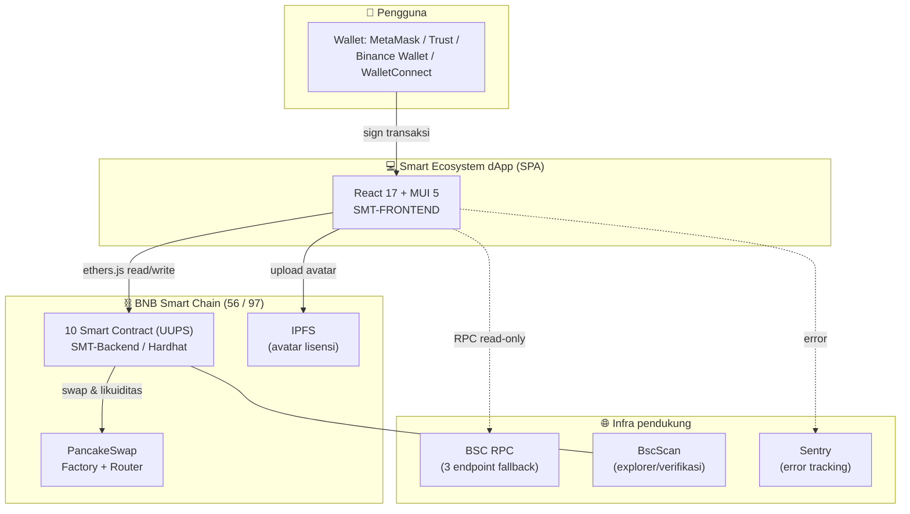
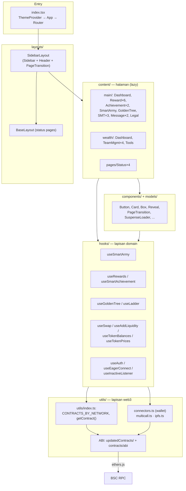
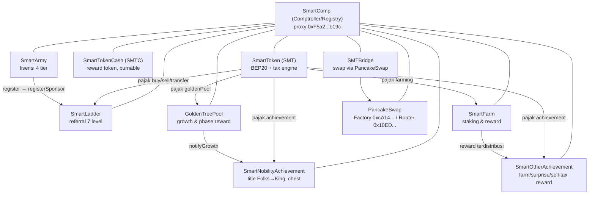
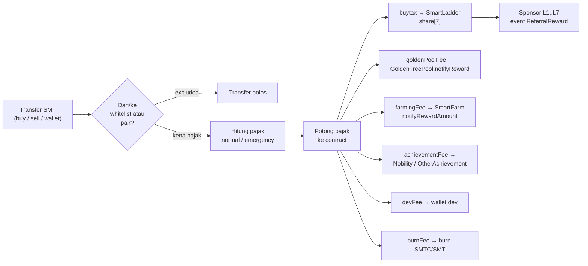
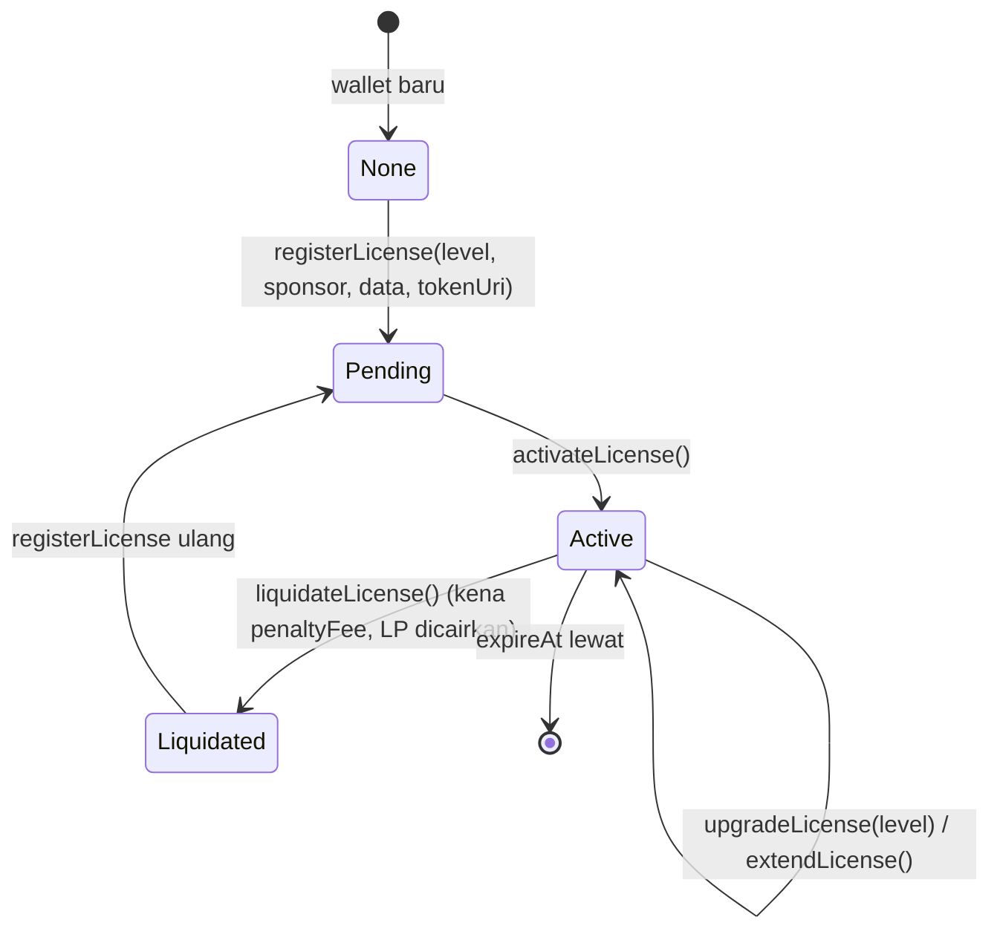
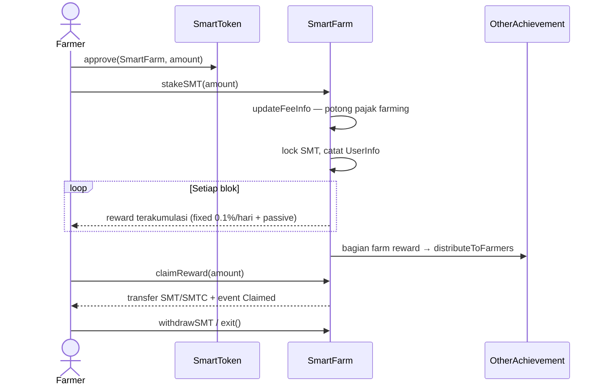
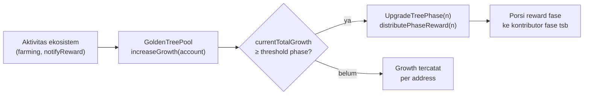
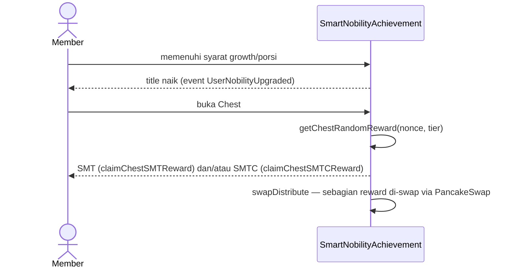
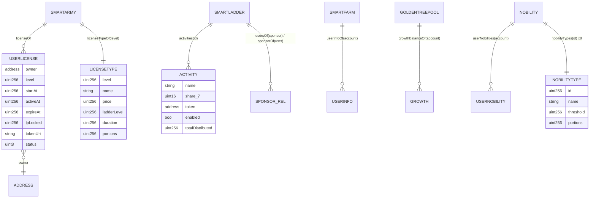
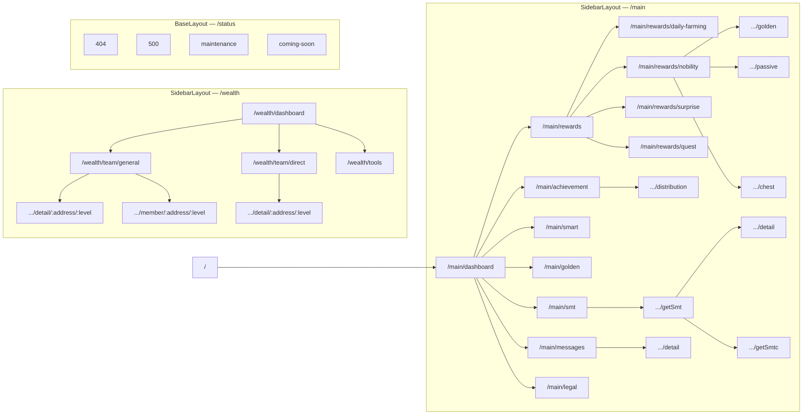

# 05 — Architecture & Diagrams

> Semua diagram memakai **Mermaid** (render di GitHub/VS Code/[mermaid.live](https://mermaid.live)).
> Diagram ini adalah *source of truth* arsitektur; perubahan signifikan wajib memperbarui dokumen ini.

---

## 1. System Context (C4 Level 1)

**Prinsip utama:** *serverless dApp* — tidak ada backend REST. Seluruh data bisnis dibaca langsung dari kontrak; satu-satunya layanan eksternal adalah RPC, IPFS (avatar), Sentry, dan explorer.

---

## 2. Arsitektur Frontend (C4 Level 2 + layering)

**Aturan dependensi:** `content → hooks → utils → ABI`. Komponen halaman tidak boleh membangun `Contract` ethers sendiri.

---

## 3. Arsitektur Kontrak (C4 Level 2)

### 3.1 Relationship antar kontrak

**Pola:** setiap kontrak bisnis menyimpan referensi `ISmartComp comptroller` dan menarik alamat kontrak lain dari sana (`comptroller.getSMT()` dll). Ganti alamat = satu fungsi owner di SmartComp, tanpa redeploy.

### 3.2 SmartComp — service locator on-chain

| Fungsi registry | Mengembalikan |
|---|---|
| `getSMT()` / `getSMTC()` / `getBUSD()` / `getWBNB()` | Token |
| `getUniswapV2Factory()` / `getUniswapV2Router()` | DEX |
| `getSmartArmy()` / `getSmartLadder()` / `getSmartFarm()` / `getGoldenTreePool()` | Modul bisnis |
| `getSmartNobilityAchievement()` / `getSmartOtherAchievement()` / `getSmartBridge()` | Modul reward & bridge |

Setter masing-masing `onlyOwner` → inilah mekanisme "plug & play" saat upgrade.

---

## 4. Alur Bisnis Utama

### 4.1 Engine pajak SMT (inti ekonomi)

- `SmartLadder.initActivities()` — share default (basis 10000): **buytax** `[5000,500,500,750,750,1250,1250]`, **farmtax** `[5500,250,250,750,750,1250,1250]`, plus `smartliving`, `ecosystem`.
- Emergency tax: operator menaikkan pajak sementara (`setBuyFee` dll), dashboard menampilkan status live.

### 4.2 Siklus hidup lisensi (state machine)

Event terkait: `RegisterLicense`, `ActivatedLicense`, `UpgradeLicense`, `LiquidateLicense`, `ExtendLicense`.

### 4.3 Farming (stake → reward → claim)

### 4.4 Golden Tree — growth & fase

- Growth per akun menentukan kualifikasi reward fase (`growthBalanceOf`, `contributionOf`).
- Threshold & fase dikonfigurasi on-chain; dApp hanya membaca.

### 4.5 Nobility & Chest

Porsi distribusi antar noble leader memakai `PortionInfo`: Folks 1 … King 5.

---

## 5. Model Data On-Chain (ERD logis)

---

## 6. Arsitektur UI ( halaman & navigasi )

Code-splitting: setiap route `React.lazy` + `SuspenseLoader`; transisi antar halaman via `PageTransition` (key = pathname).

---

## 7. Keputusan Arsitektur (ADR ringkas)

| # | Keputusan | Alasan | Konsekuensi |
|---|-----------|--------|-------------|
| ADR-1 | Tanpa backend REST; baca langsung kontrak | Transparansi penuh, tidak ada titik pusat yang bisa dimanipulasi | Bergantung pada RPC; perlu multicall & fallback |
| ADR-2 | UUPS upgradeable (bukan immutable) | Ekosistem masih berkembang cepat | Butuh disiplin keamanan owner (R2 BRD) |
| ADR-3 | Registry pattern via SmartComp | Ganti modul tanpa sentuh kontrak lain | Semua kontrak bergantung SmartComp — jangan hapus |
| ADR-4 | React 17 + CRA 4 (legacy) | Warisan proyek; stabil | Upgrade path: migrasi Vite + React 18 saat F2+ |
| ADR-5 | ABI diduplikasi ke frontend (`updatedContracts`) | Frontend tidak tergantung proses build kontrak | Wajib sinkron manual tiap upgrade ABI |
| ADR-6 | Animasi via utility CSS global | Konsisten, murah, mudah dihapus | Kebisingan visual bila diboroskan — patuhi guideline |
| ADR-7 | Data notifikasi/pesan masih mock | Belum ada indexer | Roadmap F2: event indexer off-chain |

---

## 8. Skalabilitas & Batas

- **Read scale:** multicall menggabungkan puluhan `call` per halaman; RPC publik BSC cukup untuk komunitas menengah, RPC berbayar untuk besar.
- **Write scale:** semua write = transaksi user sendiri (tidak ada backend yang menulis) → sehat.
- **Indexer:** untuk riwayat earning/messages skalabel, tambahkan subgraph (The Graph) atau event-listener sederhana → tulis ke DB read-only (roadmap F2/F3).
