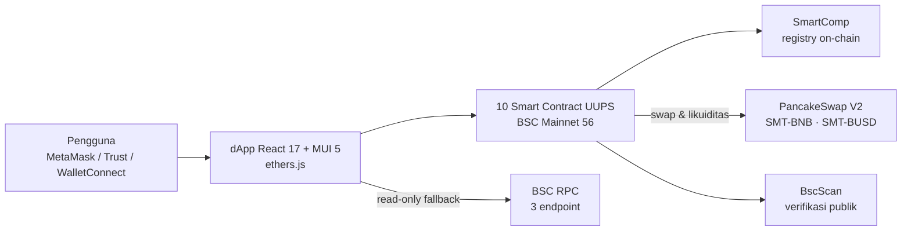
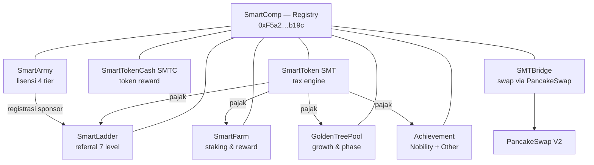
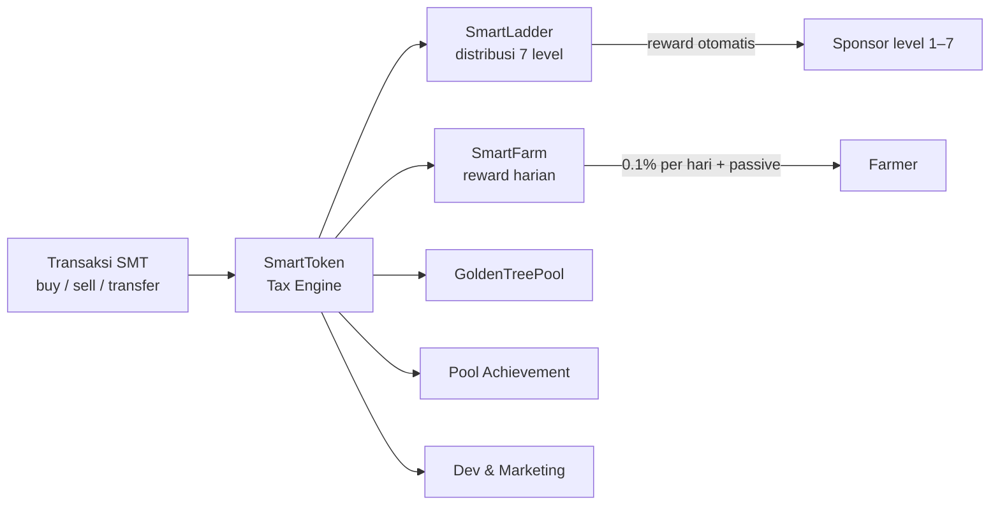

# 16 — Hackathon Submission (Portal Form)

> Konten siap-copy untuk formulir submission. Terakhir diperbarui: 2026-10-05.

---

## Nama Project
`smarttoken-dapp`

## Tagline (satu kalimat)
> Ekosistem DeFi satu pintu di BNB Smart Chain — reward referral 7 level, farming, dan lisensi keanggotaan terdistribusi otomatis on-chain lewat 10 smart contract UUPS.

## Track *(pilih yang mana)*
- ✅ **Finance & Commerce** (utama — DeFi, tokenomics, farming, DEX)
- ✅ **Consumer Apps** (sekunder — dApp konsumen satu pintu untuk pengguna awam)
- ❌ AI Agents — *jangan dipilih, tidak ada komponen AI di project ini; juri akan menggali dan gagal menemukannya.*

## Contract Address
`0xf3F9B44b88CA47Ea583F6Fde50A8C853e3c09c28` — SMT (SmartToken) di BNB Smart Chain Mainnet (chain 56), sudah terverifikasi di BscScan.

## Network
BNB Smart Chain (Mainnet)

## GitHub Repo
`https://github.com/eka0789/smarttoken-dapp`

> ⚠️ **WAJIB sebelum submit:** repo saat ini **private**. Ubah ke publik:
> GitHub → repo → Settings → General → bagian bawah *Danger Zone* → *Change repository visibility* → Public.
> (Sudah diperiksa 2026-10-04: tidak ada private key/mnemonic/secret yang ter-commit — semua config membaca dari env var.)

## Website Project
✅ **LIVE:** `https://smtdapp.vercel.app` (deployed 2026-10-04, akun Vercel eka0789, project `smtdapp`)
Config deploy: `vercel.json` di folder frontend (build `CI=false npm run build`, install `--legacy-peer-deps`, SPA rewrites untuk route `/main/*` & `/wealth/*`).
> Catatan: `smarttoken.vercel.app` sudah dipakai orang lain, maka dipakai `smtdapp`. Deep-link (mis. `/main/dashboard`) bisa langsung dibuka tanpa 404.

### Migrasi domain `smarttoken.finance` → `smtdapp.vercel.app`
Per 2026-10-05, seluruh tautan lama `smarttoken.finance` sudah dialihkan (4 referensi di 3 file):

| File | Tautan | Halaman tujuan |
|---|---|---|
| `src/content/main/dashboard/Achievement.tsx` | `/docTutorial.html` | Tutorial |
| `src/content/main/dashboard/Learn.tsx` | `/docPaper.html` | Whitepaper |
| `src/content/main/smart-army/HelpCard.tsx` | `/docTutorial.html` + `/docPaper.html` | Tutorial & Whitepaper |

Kedua halaman sebelumnya **tidak ada** di repo (link mati → 404). Kini dibuat sebagai halaman statis di `public/`:
- `public/docTutorial.html` — panduan langkah demi langkah (connect wallet, Smart Army, Smart Ladder, farming, swap, Golden Tree, FAQ).
- `public/docPaper.html` — whitepaper (masalah, solusi, arsitektur on-chain, tax engine, keamanan, roadmap).

Verifikasi production: `https://smtdapp.vercel.app/docTutorial.html` → 200, `https://smtdapp.vercel.app/docPaper.html` → 200. Tidak ada lagi sisa string `smarttoken.finance` di source, build, maupun deck.

## Problem Statement *(copy ke formulir)*

Program reward, farming, dan referral di dunia crypto masih dikuasai dua ekstrem yang sama-sama buruk. Di satu sisi, distribusi reward dilakukan manual oleh admin — tidak transparan, sulit diaudit, dan anggota harus percaya penuh bahwa porsinya benar. Di sisi lain, banyak program referral bergaya MLM yang sebenarnya Ponzi: reward dibayar langsung dari uang anggota baru, dan kolaps begitu pertumbuhan berhenti.

Sementara itu, bagi pengguna awam, DeFi terfragmentasi: untuk sekadar berpartisipasi, mereka harus merangkai 3–5 tools berbeda (DEX untuk swap, dashboard staking terpisah, tracker referral manual, spreadsheet untuk tim) — masing-masing dengan kurva belajar sendiri. Hasilnya: mayoritas calon pengguna berhenti di tengah jalan.

Masalah ini penting karena kepercayaan adalah prasyarat adopsi. Tanpa distribusi yang bisa diverifikasi siapa pun di blockchain, program reward komunitas akan terus dicap penipuan — padahal model ekonominya bisa dirancang sehat: reward dari aktivitas ekonomi riil, bukan dari rekrutmen.

## Solution *(copy ke formulir)*

Smart Ecosystem (SMT) menyelesaikannya dengan membawa seluruh siklus hidup reward ke on-chain di BNB Smart Chain, lalu membungkusnya dalam satu aplikasi web yang mudah dipakai pemula:

1. **Distribusi 100% otomatis via smart contract.** Setiap transaksi SMT (buy/sell/transfer) dikenakan pajak yang langsung dibagi on-chain ke pool ekosistem: farming, referral ladder 7 level, Golden Tree, achievement, dan development. Tidak ada admin yang memegang distribusi — semua bisa diverifikasi di BscScan.
2. **Reward dari aktivitas ekonomi riil, bukan rekrutmen.** Sumber reward adalah fee transaksi nyata di pasar (likuiditas PancakeSwap SMT-BNB & SMT-BUSD), dan ladder referral dibatasi 7 level dengan porsi yang ditulis di kontrak — bukan skema tanpa batas.
3. **Satu pintu untuk semuanya.** dApp React menggabungkan swap PancakeSwap, pembelian lisensi keanggotaan 4 tier, farming dengan reward harian, klaim reward, manajemen tim 7 level, dan gamifikasi achievement — semua dari satu dashboard, cukup hubungkan wallet.
4. **Dapat diperbaiki tanpa memindahkan dana.** Semua kontrak bisnis memakai pola UUPS upgradeable dengan registry on-chain (SmartComp), didukung runbook operasional, rotasi ownership, dan CI test otomatis.

Hasilnya: ekosistem reward komunitas yang transparan sejak detik pertama, dan cukup sederhana untuk dipakai orang yang baru pertama kali menyentuh DeFi.

---

## Project Detail *(markdown — copy seluruh blok di bawah ini ke editor formulir)*

```markdown
# Smart Ecosystem (SMT) — DeFi Ekosistem Satu Pintu di BNB Smart Chain

Smart Ecosystem adalah platform DeFi di **BNB Smart Chain (mainnet, chain 56)** yang
menggabungkan token dengan *tax engine* on-chain, lisensi keanggotaan, farming,
referral ladder 7 level, gamifikasi achievement, dan integrasi DEX — semuanya
dikelola dari satu dApp React. Tidak ada backend REST: seluruh logika bisnis dan
distribusi reward berjalan di **10 smart contract UUPS** yang sudah terverifikasi di BscScan.

## Masalah yang Diselesaikan

| Masalah di pasar DeFi saat ini | Cara SMT menyelesaikannya |
|---|---|
| Reward didistribusikan manual oleh admin — tidak transparan | Seluruh distribusi pajak & reward dieksekusi smart contract, dapat diaudit on-chain |
| Program referral bergaya MLM yang ponzi (reward dari uang anggota baru) | Reward bersumber dari pajak transaksi riil; ladder dibatasi 7 level dengan porsi on-chain |
| DeFi terfragmentasi: pemula harus merangkai banyak tools | Satu dApp: swap, lisensi, farming, reward, manajemen tim — semua dalam satu aplikasi |
| Kontrak immutable → bug tidak bisa diperbaiki | Pola UUPS upgradeable + registry on-chain (SmartComp), dengan kontrol akses ketat |

## Arsitektur Sistem

Serverless dApp — tidak ada server tradisional. Data bisnis dibaca langsung dari
kontrak melalui BSC RPC; wallet pengguna yang menandatangani semua transaksi.



## Ekosistem Kontrak

`SmartComp` adalah *service locator* on-chain: setiap modul menarik alamat kontrak lain
dari registry, sehingga upgrade alamat cukup satu transaksi owner tanpa redeploy.



## Inti Ekonomi: Tax Engine On-Chain

Setiap transaksi SMT dikenakan pajak dengan komposisi berbeda untuk buy / sell /
transfer, lalu langsung dibagi ke pool ekosistem. Nilai pajak aktif **dibaca live dari
kontrak** oleh dashboard (tidak ada angka hardcode), dan ada *emergency tax* (+10%,
maks 24 jam) yang otomatis relevan saat harga turun ≥ 25% dalam 24 jam untuk
melindungi pool.



## Fitur Utama

- **Token SMT + SMTC** — BEP-20 dengan pajak on-chain per jenis transaksi; SMTC sebagai token reward burnable lintas modul.
- **Smart Army (lisensi)** — 4 tier: Trial (100 SMT) → Opportunist (1.000) → Runner (5.000) → Visionary (10.000); tier menentukan level ladder dan porsi reward. Siklus penuh: register → activate → upgrade → extend → liquidate.
- **Smart Ladder** — jejaring referral 7 level; setiap aktivitas mendistribusikan reward sesuai porsi on-chain (contoh buy: 50% / 5% / 5% / 7,5% / 7,5% / 12,5% / 12,5%).
- **Smart Farm** — stake SMT & LP; reward fixed 0,1%/hari + bagian passive dari pajak farming, dengan swap & tambah likuiditas otomatis di dalam kontrak.
- **Golden Tree & Achievement** — gamifikasi growth berfase dan achievement (Nobility: Folks → King) yang mengunci reward berkelanjutan bagi kontributor aktif.
- **DEX terintegrasi** — swap SMT/BNB/BUSD dan kelola likuiditas langsung dari dApp via PancakeSwap V2.
- **dApp satu pintu** — React 17 + MUI 5, WalletConnect, network guard, error boundaries, empty states; 17 halaman terverifikasi visual.

## Tech Stack

| Layer | Teknologi |
|---|---|
| Kontrak | Solidity, Hardhat, OpenZeppelin (UUPS upgradeable), CI test GitHub Actions |
| Frontend | React 17, MUI 5, ethers.js, WalletConnect v2, IPFS (avatar lisensi) |
| Infra | BNB Smart Chain mainnet, PancakeSwap V2, BscScan, Sentry (error tracking) |
| Kualitas | 18/18 test suite lulus, CI build+test, QA visual 17 halaman, runbook operasional & response insiden |

## Alamat Kontrak (BSC Mainnet — terverifikasi di BscScan)

| Kontrak | Proxy Address |
|---|---|
| SmartComp (registry) | `0xF5a2F35c97cbfabd5ac9efAE4cC6cC021F6Bb19c` |
| SmartToken (SMT) | `0xf3F9B44b88CA47Ea583F6Fde50A8C853e3c09c28` |
| SmartTokenCash (SMTC) | `0x6aedC09AE456651FccBBE357B57CA77A44f9da51` |
| SmartArmy | `0xd46F6e865B112223D62a97fF86ebd1c20be6cBA4` |
| SmartFarm | `0xfEDF921A8A0535b966b2Dc13D2c4582E6CB8B383` |
| SmartLadder | `0x5eA1eF3E7ecAABdC381F5866EB76202Ebcaf008D` |
| GoldenTreePool | `0x5Ee32C58766C288323b7de14F52b87ca4274fD55` |
| SmartNobilityAchievement | `0x37a0E7335Ede4859F86809433a6786d1B2FeA406` |
| SmartOtherAchievement | `0xaB7F3B06f132E028820071ec408ABCF9514BEFf5` |
| SMTBridge | `0x93c2Cd7221f8930f4C7B1Cc146D6e24D73aAC694` |

LP pair: SMT-BNB `0x2A5834B777Fe6e2a9830C04Ba7C215BBa649C8D3` · SMT-BUSD `0xfbeC5B4878E6401522D98459FcF9B2E0bF8bbac5`

## Keamanan

- Semua kontrak bisnis **UUPS upgradeable** dengan initializer terkunci; registry `SmartComp` memvalidasi `isComptroller()`.
- Kontrol akses berlapis: `onlyOwner` (strategis), `onlyOperator` (operasional harian), `distributor` (pemicu reward).
- Runbook rotasi ownership, panduan response insiden, dan skrip verifikasi `owner()` pasca-transaksi tersedia di repo (`docs/12–13`).
- CI: build + test otomatis di setiap push; 18/18 test lulus per rilis terakhir.

## Status & Roadmap

- ✅ 10 kontrak terdeploy & terverifikasi di BSC mainnet
- ✅ dApp produksi: build sukses, QA visual 17 halaman, network guard & error handling
- ⏭️ Audit eksternal kontrak (tersedianya dana hadiah)
- ⏭️ Onboarding komunitas awal & kampanye lisensi
```

---

## Video Demo *(WAJIB)*
✅ **VIDEO SUDAH TEREKAM** — `video-assets/SMT-Video-Demo.mp4` (2:50, 1080p, narasi TTS bahasa Indonesia, walkthrough seluruh dApp dengan data live mainnet).
Catatan: ini versi **read-only** (tanpa transaksi wallet — butuh dana asli). Untuk versi dengan transaksi wallet asli (connect, swap, beli lisensi), pakai naskah produksi di **[docs/17-VIDEO-DEMO-SCRIPT.md](17-VIDEO-DEMO-SCRIPT.md)** + kartu di `video-assets/`.
Upload MP4 ini ke YouTube (unlisted) → paste link ke formulir.

## Pitch Deck *(WAJIB)*
✅ **SUDAH JADI** — `SMT-Pitch-Deck.pptx` di root repo (10 slide, palet emas BNB, bahasa Indonesia).
Cara pakai: upload file ke Google Drive / Canva → set sharing "Anyone with the link – Viewer" → paste link-nya ke formulir.
Outline 10 slide (kalau mau edit): Cover · Problem · Solution · Product · Ekonomi (tax engine + grafik ladder) · Arsitektur · Traction · Keamanan · Roadmap · Tim & Link.

## Logo *(WAJIB)*
Belum ada file logo di repo. Butuh gambar (disarankan persegi ≥ 512×512, PNG transparan) — bisa dibuat dari ikon "SMT" bertema pohon/hexagon BSC.

---

## Checklist Sebelum Submit

- [ ] Repo diubah ke **public** (sudah diverifikasi aman dari secret)
-  [x] Deploy frontend ke Vercel → https://smtdapp.vercel.app
- [ ] Upload logo
- [ ] Rekam & upload video demo ke YouTube → isi link
- [ ] Buat pitch deck di Canva → share link publik
- [ ] Track: Finance & Commerce (+ Consumer Apps opsional)
- [ ] Paste Project Detail dari dokumen ini (mode **Write/Markdown**, bukan Preview)
